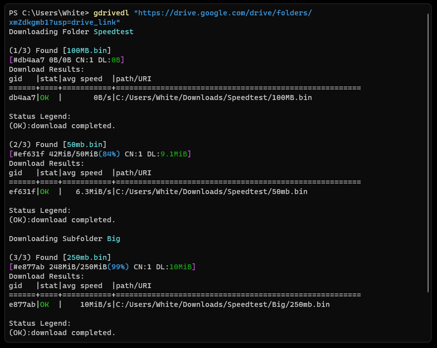

# gdrivedl

You can download Google Drive files and folders from the command line using the Google Drive Downloader with aria2 (gdrivedl).



## Features

- Using `token.pickle` to access Google Drive APIs.
- Download the Folder on Local as it was structured on Google Drive.
- Resuming partially downloaded files
- Skipping Existing files

## Requirement

- [python](https://www.python.org/)
- Then install these librarys

```text
pip install google-auth-oauthlib google-auth google-auth-httplib2 google-api-python-client
```

## Documentation

> [!NOTE]
> Using your own account OAuth 2.0 Client is always preferable. You can also use rclone OAuth 2.0 Client, but it frequently returns the "Rate Limit Exceeded" error.

<details>

<summary>Create Your Own Account OAuth 2.0 Client IDs to access Google Drive API</summary>

### Enable Google Drive API

Before using Google APIs, you need to turn them on in a Google Cloud project. You can turn on one or more APIs in a single Google Cloud project.

In the [Google Cloud console](https://console.cloud.google.com/flows/enableapi?apiid=drive.googleapis.com), enable the Google Drive API. 

#### Getting credentials for a desktop application

To authenticate as an end user and access user data in your app, you need to create one or more OAuth 2.0 Client IDs. A client ID is used to identify a single app to Google's OAuth servers. If your app runs on multiple platforms, you must create a separate client ID for each platform.

1. In the Google Cloud console, go to Menu ≡ > APIs & Services > [Credentials](https://console.cloud.google.com/apis/credentials).
2. Click Create Credentials > OAuth client ID.
3. Click Application type > Desktop app.
4. In the Name field, type a name for the credential. This name is only shown in the Google Cloud console.
5. Click Create. The OAuth client created screen appears, showing your new Client ID and Client secret.
6. Click OK. and Use the download button to download your credentials.

#### Detailed Guides

- [Google Workspace](https://developers.google.com/workspace/guides/get-started)
- [glotlabs](https://github.com/glotlabs/gdrive/blob/main/docs/create_google_api_credentials.md)
- [rclone](https://rclone.org/drive/#making-your-own-client-id)

</details>

### Usage

```text
gdrivedl -h
usage: gdrivedl.py [-h] [--auth OAuth_client] [--limit Speed_Limit] [link]

Google Drive Downloader with aria2 integration.

positional arguments:
  link                 Google Drive Link

options:
  -h, --help           show this help message and exit
  --auth OAuth_client  Set up OAuth 2.0 client_secret to Access Google Drive APIs
  --limit Speed_Limit  Set download speed limit (Example: 500K, 10M)
```

### Examples

- Using OAuth 2.0 client_secrets credentials to access Google Drive API

```powershell
python gdrivedl.py --auth "path/client_secrets.json"
```

- To Download files or folders

```powershell
python gdrivedl.py "Link"
```

- Download files or folders with speed limit

```powershell
python gdrivedl.py "Link" --limit 10M
```

## Credit

- ChatGPT
- [Aria2](https://aria2.github.io/)
