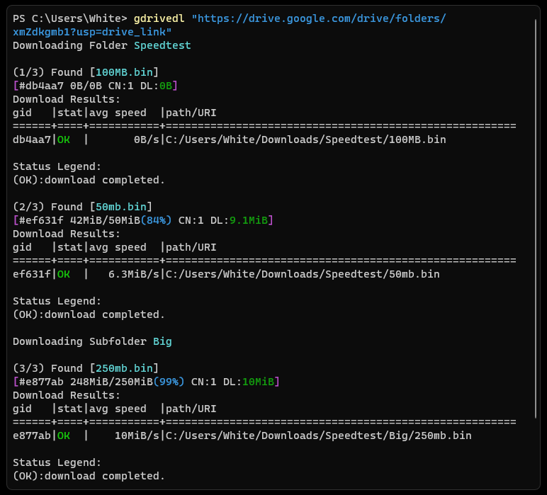

# gdrivedl

You can download Google Drive files and folders from the command line using the Google Drive Downloader with aria2 (gdrivedl).



## Features

- Using `token.pickle` to access Google Drive APIs.
- Download the Folder on Local as it was structured on Google Drive.
- Resuming partially downloaded files
- Skipping Existing files

## Requirement

- [python](https://www.python.org/)
- Then install these librarys

```text
pip install google-auth-oauthlib google-auth google-auth-httplib2 google-api-python-client
```

- [aria2](https://aria2.github.io/)

## Documentation

> [!NOTE]
> Using your own account OAuth 2.0 Client is always preferable. You can also use rclone OAuth 2.0 Client, but it frequently returns the "Rate Limit Exceeded" error.

### Create Your Own Account OAuth 2.0 Client IDs to access Google Drive API

1. Create a [Google Cloud project](https://console.cloud.google.com/projectcreate)
2. Enable [Google Drive API](https://console.cloud.google.com/flows/enableapi?apiid=drive.googleapis.com)
3. Configure [OAuth consent](https://console.cloud.google.com/apis/credentials/consent) & Publish your app (to prevent the token from expiring after 7 days), **Make sure that you do not select any scopes** for your app. It allows you to publish your app instantly.
4. Create access [credentials](https://console.cloud.google.com/apis/credentials) Create OAuth client ID credentials Click Create **Credentials > OAuth client ID**. Click **Application type > Desktop app**.
5. Download your OAuth client ID credentials.

#### Detailed Guides

- [Google Workspace Guide](https://developers.google.com/workspace/guides/get-started)
- [glotlabs](https://github.com/glotlabs/gdrive/blob/main/docs/create_google_api_credentials.md)
- [rclone](https://rclone.org/drive/#making-your-own-client-id)

### Usage

Make sure to change **Default download location** the in the gdrivedl.py file. https://github.com/dg0072/gdrivedl/blob/fdc7cf1963eef959467e161a72110c01720d857e/gdrivedl.py#L16 

```text
gdrivedl -h
usage: gdrivedl.py [-h] [--auth OAuth_client] [--limit Speed_Limit] [link]

Google Drive Downloader with aria2 integration.

positional arguments:
  link                 Google Drive Link

options:
  -h, --help           show this help message and exit
  --auth OAuth_client  Set up OAuth 2.0 client_secret to Access Google Drive APIs
  --limit Speed_Limit  Set download speed limit (Example: 500K, 10M)
```

### Examples

- Using OAuth 2.0 client_secrets credentials to access Google Drive API

```powershell
python gdrivedl.py --auth "path/client_secrets.json"
```

- To Download files or folders

```powershell
python gdrivedl.py "Link"
```

- Download files or folders with speed limit

```powershell
python gdrivedl.py "Link" --limit 10M
```

## Credit

- ChatGPT
- [Aria2](https://aria2.github.io/)
